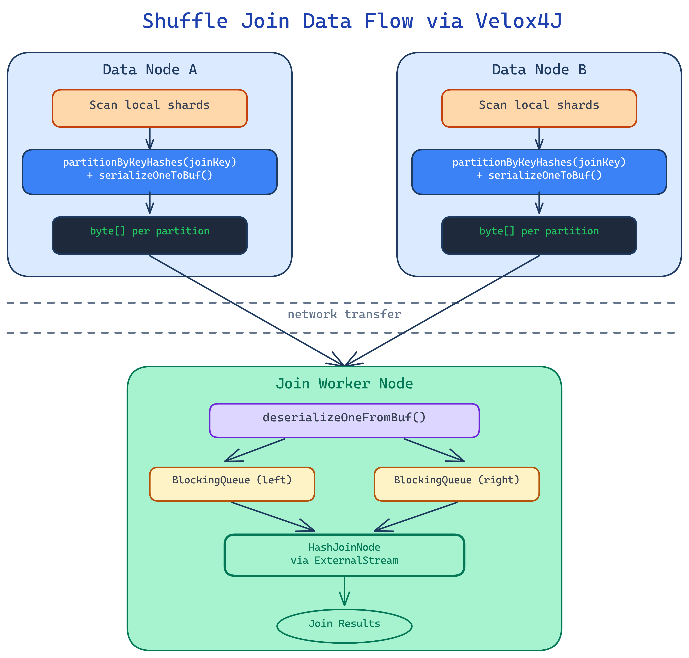
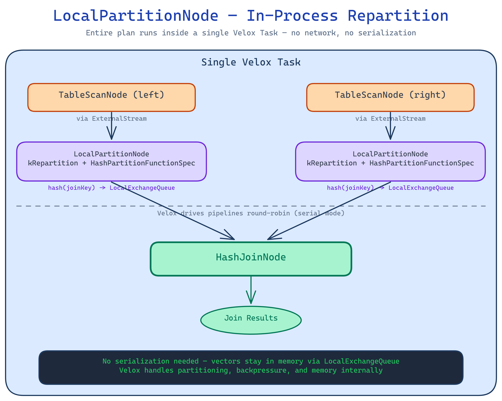

# Lesson 12: Joins & Distributed Execution

## Learning Goals

After this lesson you should be able to:

- Construct and execute a HashJoinNode in Velox4J with proper split management
- Explain how Velox's serial execution mode runs multi-pipeline join plans on a single thread
- List all join plan node types in Velox C++ and know which are exposed in Velox4J
- Describe the full Velox distributed shuffle architecture: PartitionedOutput → OutputBufferManager → ExchangeClient → Exchange
- Explain why Velox4J cannot support Exchange/PartitionedOutput and how frameworks like Gluten-Flink work around this
- Design a distributed join strategy using Velox4J as the local execution engine
- Use `hashPartition()` and `hashPartitionAndSerialize()` for consistent shuffle partitioning
- Understand lazy vector materialization and when to flatten before serialization
- Use `LocalPartitionNode` for in-process repartitioning within a Velox plan tree

---

## 12.1 Join Support in Velox4J Today

Velox4J exposes a single join plan node: `HashJoinNode`. It covers the vast majority of join use cases through its `JoinType` enum, which supports 9 join semantics.

### The Java class hierarchy

```
PlanNode (abstract)
  └── AbstractJoinNode (abstract)
        ├── joinType: JoinType
        ├── leftKeys: List<FieldAccessTypedExpr>
        ├── rightKeys: List<FieldAccessTypedExpr>
        ├── filter: TypedExpr (optional post-join filter)
        ├── outputType: RowType
        └── sources: [left, right]  (exactly 2)
              │
              └── HashJoinNode (concrete)
                    ├── nullAware: boolean
                    └── useHashTableCache: boolean
```

**Source:** `src/main/java/org/boostscale/velox4j/plan/AbstractJoinNode.java`, `src/main/java/org/boostscale/velox4j/plan/HashJoinNode.java`

### JoinType enum

```java
public enum JoinType {
    INNER("INNER"),                              // Standard inner join
    LEFT("LEFT"),                                // Left outer join
    RIGHT("RIGHT"),                              // Right outer join
    FULL("FULL"),                                // Full outer join
    LEFT_SEMI_FILTER("LEFT SEMI (FILTER)"),      // EXISTS: return left rows with a match
    RIGHT_SEMI_FILTER("RIGHT SEMI (FILTER)"),    // Opposite of LEFT_SEMI_FILTER
    LEFT_SEMI_PROJECT("LEFT SEMI (PROJECT)"),    // IN: return left rows with a match flag
    RIGHT_SEMI_PROJECT("RIGHT SEMI (PROJECT)"),  // Opposite of LEFT_SEMI_PROJECT
    ANTI("ANTI");                                // NOT EXISTS / NOT IN: left rows without match
}
```

The `@JsonValue` annotation ensures each enum serializes to its string value (e.g., `"LEFT SEMI (FILTER)"`), which matches the C++ `JoinTypeName` mapping in Velox.

**Source:** `src/main/java/org/boostscale/velox4j/join/JoinType.java`

### Missing JoinType values

The C++ Velox `JoinType` enum (`velox/core/PlanNode.h:2948`) has 11 values. Velox4J is missing two:

| C++ Enum | Value | Purpose | Java Status |
|---|---|---|---|
| `kCountingLeftSemiFilter` | 5 | INTERSECT ALL semantics (dedup + count) | **Missing** |
| `kCountingAnti` | 10 | EXCEPT ALL semantics (dedup + count) | **Missing** |

These are specialized multiset join types used by Presto for `INTERSECT ALL` and `EXCEPT ALL` queries.

---

## 12.2 Constructing a HashJoinNode

### Basic construction

```java
HashJoinNode join = new HashJoinNode(
    "join-1",                          // unique plan node ID
    JoinType.INNER,                    // join type
    ImmutableList.of(                  // left join keys
        FieldAccessTypedExpr.create(new BigIntType(), "left_key")),
    ImmutableList.of(                  // right join keys (must match left count)
        FieldAccessTypedExpr.create(new BigIntType(), "right_key")),
    null,                              // optional post-join filter (TypedExpr)
    leftScanNode,                      // left source (PlanNode)
    rightScanNode,                     // right source (PlanNode)
    outputType,                        // output schema (RowType)
    false,                             // nullAware
    false                              // useHashTableCache
);
```

Key rules:
- **Join keys** must be `FieldAccessTypedExpr` column references. The left and right key lists must have the same length — each pair forms one equi-join condition.
- **Output type** is the combined schema. You choose which columns from each side to include. Columns from the left side come first, then the right side.
- **Post-join filter** is optional. It is applied to join matches — if it evaluates to false, the match turns into a miss. For outer joins, this means the row gets null-padded instead of being dropped entirely. For inner joins, it's equivalent to a `FilterNode` above the join.
- **nullAware** applies only to semi and anti joins. When `true`, the join follows IN/NOT IN semantics (NULLs propagate). When `false`, it follows EXISTS/NOT EXISTS semantics (NULLs are ignored). Null-aware joins require exactly one join key.
- **useHashTableCache** enables hash table caching for broadcast joins in Presto-on-Spark. The hash table built from the broadcast side is cached and reused across tasks.

### JSON serialization

A `HashJoinNode` registered as `"HashJoinNode"` in `ISerializableRegistry` serializes to:

```json
{
  "name": "HashJoinNode",
  "id": "join-1",
  "sources": [ { ... left scan ... }, { ... right scan ... } ],
  "joinType": "INNER",
  "leftKeys": [ { "name": "FieldAccessTypedExpr", ... } ],
  "rightKeys": [ { "name": "FieldAccessTypedExpr", ... } ],
  "filter": null,
  "outputType": { "name": "Type", "type": "ROW", ... },
  "nullAware": false
}
```

On the C++ side, Velox's `PlanNode::registerSerDe()` registers `"HashJoinNode"` → `HashJoinNode::create()`, which deserializes this JSON directly into a `velox::core::HashJoinNode`.

**Source:** `velox/core/PlanNode.h:3293`, `velox/core/PlanNode.cpp` (HashJoinNode::create)

---

## 12.3 Executing a Join Query

### Complete example from the test suite

This example from `QueryTest.testHashJoin()` performs a LEFT join between TPC-H NATION and REGION tables:

```java
// 1. Define schemas
final RowType nationSchema = NATION_FILE.schema();  // (n_nationkey, n_name, n_regionkey, n_comment)
final RowType regionSchema = REGION_FILE.schema();  // (r_regionkey, r_name, r_comment)

// 2. Create scan nodes for both sides
final TableScanNode nationScan = newSampleTableScanNode("id-1", nationSchema);
final TableScanNode regionScan = newSampleTableScanNode("id-2", regionSchema);

// 3. Build the join node
final HashJoinNode join = new HashJoinNode(
    "id-3",
    JoinType.LEFT,
    ImmutableList.of(FieldAccessTypedExpr.create(new BigIntType(), "n_regionkey")),
    ImmutableList.of(FieldAccessTypedExpr.create(new BigIntType(), "r_regionkey")),
    null,                   // no post-join filter
    nationScan,             // left = nations
    regionScan,             // right = regions
    new RowType(
        ImmutableList.of("n_nationkey", "n_name", "r_regionkey", "r_name"),
        ImmutableList.of(new BigIntType(), new VarCharType(), new BigIntType(), new VarCharType())),
    false, false);

// 4. Execute
final Query query = new Query(join, Config.empty(), ConnectorConfig.empty());
final SerialTask task = session.queryOps().execute(query);

// 5. CRITICAL: add splits to BOTH scan nodes
task.addSplit(nationScan.getId(), nationSplit);
task.addSplit(regionScan.getId(), regionSplit);
task.noMoreSplits(nationScan.getId());
task.noMoreSplits(regionScan.getId());

// 6. Iterate results
Iterator<RowVector> results = UpIterators.asJavaIterator(task);
while (results.hasNext()) {
    RowVector batch = results.next();
    // process...
}
```

**Source:** `src/test/java/org/boostscale/velox4j/query/QueryTest.java:716`

### Split management for joins

Splits are added to **TableScanNodes**, never to the join node itself. For a join with two table scans:

```java
// Both sides need splits
task.addSplit(leftScan.getId(), leftSplit);
task.addSplit(rightScan.getId(), rightSplit);

// BOTH sides need noMoreSplits — missing one causes the task to hang
task.noMoreSplits(leftScan.getId());
task.noMoreSplits(rightScan.getId());
```

For multi-file tables, you can add multiple splits to one scan:

```java
for (File file : leftDataFiles) {
    task.addSplit(leftScan.getId(), newSplit(file));
}
task.noMoreSplits(leftScan.getId());
```

---

## 12.4 How HashJoin Executes in Serial Mode

This is the most architecturally interesting part. A HashJoin requires **two pipelines** running concurrently — but Velox4J uses serial execution mode (single thread). How does this work?

### Plan compilation: one plan, two pipelines

When Velox's `LocalPlanner` encounters a `HashJoinNode` in the plan tree, it splits the plan into **two separate DriverFactories** (pipelines):

```
Plan tree:                           Compiled pipelines:
─────────                            ───────────────────

  HashJoinNode                       Pipeline 0 (build):
  ├── left: TableScan(nations)         TableScan(regions) → HashBuild
  └── right: TableScan(regions)
                                     Pipeline 1 (probe):
                                       TableScan(nations) → HashProbe → output
```

The `LocalPlanner` walks the plan tree. When it hits a `HashJoinNode`:
- The **right child** (build side) becomes the source for a `HashBuild` operator in a **separate pipeline**
- The `HashJoinNode` itself becomes a `HashProbe` operator in the **main pipeline**
- The two pipelines communicate through a `HashJoinBridge` — an in-process shared data structure

**Source:** `velox/exec/LocalPlanner.cpp:191` (HashBuild creation), `velox/exec/LocalPlanner.cpp:561` (HashProbe creation)

### Serial execution: round-robin driver loop

In serial mode, `Task::init()` creates all drivers (one per pipeline) but runs them on the **same thread**. The `Task::next()` method implements a round-robin loop:

```cpp
// velox/exec/Task.cpp:872 — simplified serial execution loop
for (;;) {
    int runnableDrivers = 0;
    int blockedDrivers = 0;

    for (auto i = 0; i < numDrivers; ++i) {
        auto driver = getDriver(i);
        if (driver == nullptr) continue;          // driver finished

        if (!futures[i].isReady()) {
            ++blockedDrivers;                     // still blocked from last round
            continue;
        }

        ++runnableDrivers;
        auto result = driver->next(&future);      // run one step

        if (result != nullptr) {
            return result;                        // output pipeline produced a batch!
        }

        if (future.valid()) {
            futures[i] = std::move(future);       // driver is now blocked
        }
    }

    if (runnableDrivers == 0) {
        if (blockedDrivers > 0) {
            // All drivers blocked — return combined future to caller
            *future = folly::collectAny(notReadyFutures).unit();
        }
        return nullptr;  // finished or blocked
    }
}
```

### The execution timeline

Here's what happens step by step when you call `task.advance()` on a hash join:

```
Call 1-N: advance() → Task::next() round-robin loop
  ┌─────────────────────────────────────────────────────────┐
  │ Round 1:                                                 │
  │   Driver 0 (build): TableScan → reads batch → HashBuild │
  │     → accumulates rows into hash table                   │
  │     → returns nullptr (no output, still building)        │
  │   Driver 1 (probe): HashProbe → blocked!                 │
  │     → hash table not ready, returns future               │
  │                                                          │
  │ Round 2-M:                                               │
  │   Driver 0 (build): continues reading splits, building   │
  │   Driver 1 (probe): still blocked (future not ready)     │
  │                                                          │
  │ Round M+1:                                               │
  │   Driver 0 (build): all splits read → hash table done    │
  │     → signals HashJoinBridge → driver finishes           │
  │   Driver 1 (probe): unblocked! future is ready           │
  │     → starts reading left-side splits                    │
  │     → probes hash table → produces output batches        │
  │     → Task::next() returns RowVector!                    │
  └─────────────────────────────────────────────────────────┘
```

The key insight: **no threads are needed**. The single calling thread alternates between drivers. When the build driver blocks on I/O (waiting for splits), the probe driver tries to run (but is blocked on the hash table). When the build finishes, the probe unblocks and starts producing output. All coordination happens through futures and the HashJoinBridge.

**Source:** `velox/exec/Task.cpp:838` (Task::next serial loop), `velox/exec/HashBuild.h`, `velox/exec/HashProbe.h`

---

## 12.5 All Join Node Types in Velox C++

Velox's C++ engine (`velox/core/PlanNode.h`) defines **5 join plan node types**. All are registered in `PlanNode::registerSerDe()`:

### HashJoinNode (line 3293)

The workhorse join. Compiles into a `HashBuild` + `HashProbe` operator pair.

```cpp
class HashJoinNode : public AbstractJoinNode {
    bool nullAware_;          // IN/NOT IN vs EXISTS/NOT EXISTS semantics
    bool useHashTableCache_;  // cache hash table for broadcast joins
};
```

- **Supported join types**: all 11 `JoinType` values
- **Algorithm**: Build phase reads the right side into a hash table. Probe phase streams the left side and probes the table.
- **Spilling**: Supported (can spill hash table to disk if memory is tight), except for null-aware anti joins with a filter.
- **Serial mode**: Supported (two pipelines, round-robin)

**Source:** `velox/core/PlanNode.h:3293`, `velox/exec/HashBuild.h`, `velox/exec/HashProbe.h`

### MergeJoinNode (line 3443)

An equi-join that assumes **both inputs are already sorted** by join keys.

```cpp
class MergeJoinNode : public AbstractJoinNode {
    // No extra fields beyond AbstractJoinNode
};
```

- **Supported join types**: INNER, LEFT, RIGHT, FULL, LEFT_SEMI_FILTER, RIGHT_SEMI_FILTER, ANTI
- **Algorithm**: Merge-sort style — walks both sorted streams in parallel. More efficient than hash join when data is pre-sorted.
- **Requires single thread**: `requiresSingleThread()` returns true
- **Serde name**: `"MergeJoinNode"` — same JSON schema as HashJoinNode minus `nullAware`/`useHashTableCache`

**Source:** `velox/core/PlanNode.h:3443`, `velox/exec/MergeJoin.h`

### NestedLoopJoinNode (line 3822)

For **non-equi joins** and **cross joins**. Does NOT extend `AbstractJoinNode`.

```cpp
class NestedLoopJoinNode : public PlanNode {  // NOT AbstractJoinNode!
    JoinType joinType_;
    TypedExprPtr joinCondition_;  // arbitrary condition (not just equi-keys)
    RowTypePtr outputType_;
};
```

Key differences from Hash/Merge joins:
- **No `leftKeys`/`rightKeys`** — instead has a single `joinCondition` (any `TypedExpr`)
- **Cross join**: when `joinCondition` is null, every left row pairs with every right row
- **Non-equi conditions**: supports conditions like `a.price > b.min_price AND a.price < b.max_price`
- **Serde name**: `"NestedLoopJoinNode"`

**Source:** `velox/core/PlanNode.h:3822`, `velox/exec/NestedLoopJoinProbe.h`

### IndexLookupJoinNode (line 3661)

For joins where the right side is an **indexed table** that supports point lookups.

```cpp
class IndexLookupJoinNode : public AbstractJoinNode {
    std::vector<IndexLookupConditionPtr> joinConditions_;
    // Conditions can be filter conditions (constant) or join conditions (probe column)
};
```

- **Use case**: When the build side has an index and you can look up rows by key rather than scanning the entire table.
- **Serde name**: `"IndexLookupJoinNode"`

**Source:** `velox/core/PlanNode.h:3661`

### SpatialJoinNode (line 4114)

For **geospatial joins** based on proximity or containment.

```cpp
class SpatialJoinNode : public PlanNode {  // NOT AbstractJoinNode
    JoinType joinType_;
    TypedExprPtr joinCondition_;
    FieldAccessTypedExprPtr probeGeometry_;
    FieldAccessTypedExprPtr buildGeometry_;
    std::optional<FieldAccessTypedExprPtr> radius_;
    RowTypePtr outputType_;
};
```

- **Use case**: "Find all restaurants within 5 km of each customer"
- **Serde name**: `"SpatialJoinNode"`

**Source:** `velox/core/PlanNode.h:4114`

### Velox4J exposure status

| C++ Node | Serde Name | Velox4J Java | Difficulty to Add |
|---|---|---|---|
| `HashJoinNode` | `"HashJoinNode"` | `HashJoinNode` ✅ | — |
| `MergeJoinNode` | `"MergeJoinNode"` | Not exposed | Easy — extends `AbstractJoinNode`, no extra fields |
| `NestedLoopJoinNode` | `"NestedLoopJoinNode"` | Not exposed | Medium — different structure (no leftKeys/rightKeys) |
| `IndexLookupJoinNode` | `"IndexLookupJoinNode"` | Not exposed | Hard — custom `IndexLookupCondition` types needed |
| `SpatialJoinNode` | `"SpatialJoinNode"` | Not exposed | Hard — geometry-specific fields |

Adding `MergeJoinNode` only requires a new Java class extending `AbstractJoinNode` with no extra fields, plus one line in `ISerializableRegistry`:

```java
NAME_REGISTRY.registerClass("MergeJoinNode", MergeJoinNode.class);
```

Adding `NestedLoopJoinNode` requires a new Java class extending `PlanNode` directly, with fields: `joinType`, `joinCondition` (optional `TypedExpr`), `outputType`, and 2 sources.

---

## 12.6 Velox's Distributed Shuffle Architecture

While Velox4J only uses local joins, Velox C++ has a full distributed shuffle framework used by Presto/Prestissimo. Understanding it helps explain why Velox4J's scope ends where it does.

### The key components

```
┌──────────────────────────────────────────────────────────────────┐
│                   VELOX DISTRIBUTED EXECUTION                     │
│                                                                   │
│  Producer Task                            Consumer Task           │
│  ┌──────────────────┐                     ┌──────────────────┐   │
│  │ Scan / Compute    │                     │                  │   │
│  │       │           │                     │  Exchange        │   │
│  │       ▼           │                     │  (SourceOperator)│   │
│  │ PartitionedOutput │                     │       │          │   │
│  │ (SinkOperator)    │                     │       ▼          │   │
│  │       │           │                     │  Downstream ops  │   │
│  └───────┼───────────┘                     └───────┼──────────┘   │
│          │                                         ▲              │
│          ▼                                         │              │
│  OutputBufferManager                       ExchangeClient         │
│  ┌──────────────────────┐                  ┌──────────────┐      │
│  │ dest[0]: ████░░░░    │ ──serialized──>  │ ExchangeSource│      │
│  │ dest[1]: ██████░░    │    pages         │      │        │      │
│  │ dest[2]: ███░░░░░    │                  │ ExchangeQueue │      │
│  └──────────────────────┘                  └──────────────┘      │
│                                                                   │
│         PartitionFunction                                         │
│         (determines which dest each row goes to)                  │
└──────────────────────────────────────────────────────────────────┘
```

### PartitionedOutputNode — the shuffle producer

This is the **terminal operator** in a producer pipeline. It does not produce output rows — instead, it partitions and serializes data into output buffers.

```cpp
// velox/core/PlanNode.h:2709
class PartitionedOutputNode : public PlanNode {
    enum class Kind {
        kPartitioned,  // hash-partition by keys → each row to 1 destination
        kBroadcast,    // replicate ALL rows to ALL destinations
        kArbitrary,    // round-robin distribution
    };

    Kind kind_;
    std::vector<TypedExprPtr> keys_;            // partition key expressions
    int numPartitions_;                          // number of destination tasks
    bool replicateNullsAndAny_;                  // replicate NULL-key rows to all
    PartitionFunctionSpecPtr partitionFunctionSpec_;  // hash function config
    std::string serdeKind_;                      // "presto", "compact_row", "unsafe_row"
};
```

The three kinds serve different distribution strategies:

**`kPartitioned`** — Hash shuffle for distributed joins and aggregations:
```
Input rows:  [key=1, val=A]  [key=2, val=B]  [key=3, val=C]  [key=1, val=D]
                  │                │                │                │
          hash(1)%3=1      hash(2)%3=2      hash(3)%3=0      hash(1)%3=1
                  │                │                │                │
                  ▼                ▼                ▼                ▼
Dest 0: ░░░░░░░░░░░░░░░  [key=3, val=C]
Dest 1: [key=1, val=A]  ░░░░░░░░░░░░░░░  ░░░░░░░░░░░░░  [key=1, val=D]
Dest 2: ░░░░░░░░░░░░░░░  [key=2, val=B]
```

**`kBroadcast`** — Full replication for broadcast joins:
```
Input rows:  [key=1, val=A]  [key=2, val=B]
                  │                │
          replicate to all   replicate to all
                  │                │
                  ▼                ▼
Dest 0: [key=1, val=A]  [key=2, val=B]
Dest 1: [key=1, val=A]  [key=2, val=B]
Dest 2: [key=1, val=A]  [key=2, val=B]
```

**`kArbitrary`** — Round-robin for gathering results:
```
Input rows:  [row1]  [row2]  [row3]  [row4]  [row5]  [row6]
               │       │       │       │       │       │
               ▼       ▼       ▼       ▼       ▼       ▼
Dest 0:     [row1]           [row3]           [row5]
Dest 1:             [row2]           [row4]           [row6]
```

**Source:** `velox/core/PlanNode.h:2709`, `velox/exec/PartitionedOutput.h`

### ExchangeNode — the shuffle consumer

A **leaf plan node** (no child sources) that receives shuffled data from remote tasks.

```cpp
// velox/core/PlanNode.h:2179
class ExchangeNode : public PlanNode {
    RowTypePtr outputType_;
    std::string serdeKind_;

    bool requiresExchangeClient() const override { return true; }
    bool requiresSplits() const override { return true; }
};
```

`ExchangeNode` has no child `sources` — it's a leaf. Its data comes from **splits** that are `RemoteConnectorSplit` objects. Each split contains the ID of a remote producer task. The `Exchange` operator uses an `ExchangeClient` to fetch serialized pages from those tasks.

**Source:** `velox/core/PlanNode.h:2179`, `velox/exec/Exchange.h`

### ExchangeClient and ExchangeSource — pluggable data transport

The `ExchangeClient` manages fetching data from multiple producer tasks:

```cpp
// velox/exec/ExchangeClient.h
class ExchangeClient {
    std::string taskId_;                                      // consumer task ID
    int destination_;                                         // which buffer to read from
    std::unordered_set<std::string> remoteTaskIds_;          // producer task IDs
    std::vector<std::shared_ptr<ExchangeSource>> sources_;   // one per producer
    std::shared_ptr<ExchangeQueue> queue_;                   // shared receive queue
};
```

The `ExchangeSource` is a **pluggable interface** for remote data fetching:

```cpp
// velox/exec/ExchangeSource.h
class ExchangeSource {
    virtual bool shouldRequestLocked() = 0;
    virtual folly::SemiFuture<Response> request(uint32_t maxBytes, ...) = 0;

    // Factory pattern: register custom implementations
    static bool registerFactory(Factory factory) {
        factories().push_back(factory);
    }
};
```

- **Tests** use `LocalExchangeSource`: in-process via `OutputBufferManager` (same JVM/process)
- **Prestissimo** (Presto C++ worker) registers an HTTP-based implementation for cross-server communication
- **Custom engines** can register their own transport (e.g., RDMA, shared memory)

**Source:** `velox/exec/ExchangeSource.h`, `velox/exec/ExchangeClient.h`

### OutputBufferManager — the mailbox

Singleton that stores serialized pages produced by `PartitionedOutput` and serves them to `ExchangeSource` consumers:

```cpp
// velox/exec/OutputBufferManager.h (simplified API)
class OutputBufferManager {
    // Producer side:
    bool enqueue(const std::string& taskId, int destination,
                 std::unique_ptr<SerializedPageBase> data, ContinueFuture* future);

    // Consumer side:
    bool getData(const std::string& taskId, int destination,
                 uint64_t maxBytes, int64_t sequence,
                 DataAvailableCallback notify);

    // Flow control:
    void acknowledge(const std::string& taskId, int destination, int64_t sequence);
};
```

Pages are stored per `(taskId, destination)`. The `sequence` number enables at-least-once delivery with acknowledgement.

**Source:** `velox/exec/OutputBufferManager.h`

---

## 12.7 A Distributed Hash Join End-to-End

From `MultiFragmentTest.cpp`, here is how a distributed join is structured in Velox C++. This runs in **parallel execution mode** with multiple tasks across threads.

### Shuffle join (both sides repartitioned)

```
 Stage 1: Leaf tasks (shuffle both sides by join key)
 ─────────────────────────────────────────────────────

  Task "leaf-left":                    Task "leaf-right":
  ┌────────────────────────┐           ┌────────────────────────┐
  │ TableScan(left_table)   │           │ TableScan(right_table)  │
  │          │              │           │          │              │
  │          ▼              │           │          ▼              │
  │ PartitionedOutput       │           │ PartitionedOutput       │
  │  kind=kPartitioned      │           │  kind=kPartitioned      │
  │  keys=[join_key]        │           │  keys=[join_key]        │
  │  numPartitions=N        │           │  numPartitions=N        │
  └────────────────────────┘           └────────────────────────┘

 Stage 2: Join tasks (one per partition, receives shuffled data)
 ───────────────────────────────────────────────────────────────

  Task "join-0":              Task "join-1":              Task "join-(N-1)":
  ┌─────────────────────┐    ┌─────────────────────┐    ┌─────────────────────┐
  │ Exchange(left)  ─┐   │    │ Exchange(left)  ─┐   │    │ Exchange(left)  ─┐   │
  │                  │   │    │                  │   │    │                  │   │
  │             HashJoin │    │             HashJoin │    │             HashJoin │
  │                  │   │    │                  │   │    │                  │   │
  │ Exchange(right) ─┘   │    │ Exchange(right) ─┘   │    │ Exchange(right) ─┘   │
  │        │             │    │        │             │    │        │             │
  │        ▼             │    │        ▼             │    │        ▼             │
  │ PartitionedOutput    │    │ PartitionedOutput    │    │ PartitionedOutput    │
  │  kind=kArbitrary     │    │  kind=kArbitrary     │    │  kind=kArbitrary     │
  │  numPartitions=1     │    │  numPartitions=1     │    │  numPartitions=1     │
  └─────────────────────┘    └─────────────────────┘    └─────────────────────┘

 Stage 3: Root task (collects results)
 ──────────────────────────────────────

  Task "root":
  ┌──────────────────────┐
  │ Exchange              │
  │  (from join-0..N-1)   │
  │        │              │
  │        ▼              │
  │   Consumer / Sink     │
  └──────────────────────┘
```

### Broadcast join (small table replicated)

The difference is only in Stage 1 — the build side uses `kBroadcast`:

```cpp
// Build side: broadcast ALL rows to ALL join tasks
PlanBuilder()
    .tableScan(buildSchema)
    .partitionedOutputBroadcast({}, serdeKind)  // kBroadcast: replicate to all
    .planNode();

// Probe side: hash-partition by join key
PlanBuilder()
    .tableScan(probeSchema)
    .partitionedOutput({"join_key"}, N, {}, serdeKind)  // kPartitioned
    .planNode();
```

Every join task receives ALL build-side rows (no partitioning), but only its partition of probe-side rows. The hash table is built from the full broadcast data. The `useHashTableCache` flag on `HashJoinNode` can cache this hash table across tasks in Presto-on-Spark.

### Code from test (MultiFragmentTest.cpp:1678)

```cpp
// Join task plan: Exchange(left) → HashJoin ← Values(right) → PartitionedOutput
core::PlanNodePtr makeJoinOverExchangePlan(
    const RowTypePtr& exchangeType,
    const RowVectorPtr& buildData,
    std::string serdeKind) {
  auto gen = std::make_shared<core::PlanNodeIdGenerator>();
  return PlanBuilder(gen)
      .exchange(exchangeType, serdeKind)          // receives shuffled left side
      .hashJoin(
          {"c0"}, {"u_c0"},                       // join keys
          PlanBuilder(gen).values({buildData}).planNode(),  // build side (local data)
          "", {"c0"})                              // output
      .partitionedOutput({}, 1, {}, serdeKind)    // gather to 1 destination
      .planNode();
}
```

**Source:** `velox/exec/tests/MultiFragmentTest.cpp:1678`

---

## 12.8 Why Velox4J Cannot Do Distributed Exchange

The blocker is architectural, not a missing feature:

### Serial mode blocks Exchange and PartitionedOutput

```cpp
// velox/exec/Driver.h:809
bool DriverFactory::supportsSerialExecution() const {
    return !needsPartitionedOutput() && !needsExchangeClient();
}
```

A DriverFactory does NOT support serial execution if it contains:
- `PartitionedOutputNode` — a sink operator with no output rows (incompatible with pull-based `Task::next()`)
- `ExchangeNode` — requires an `ExchangeClient` with async I/O (incompatible with single-threaded pull)

Velox4J enforces this at task creation (`QueryExecutor.cc:68`):

```cpp
if (!task_->supportSerialExecutionMode()) {
    VELOX_FAIL("Task doesn't support single threaded execution: " + task->toString());
}
```

### Why these operators need parallel mode

1. **PartitionedOutput** is a sink — it consumes input and writes to output buffers, but produces no output rows. Serial mode's `Task::next()` expects the output pipeline to return `RowVector`s. A task that only has `PartitionedOutput` would return nothing.

2. **Exchange** receives data from remote tasks via async network I/O. In serial mode, there's no thread pool to run the fetch — the single calling thread would need to block on network I/O, defeating the purpose.

3. Both operators participate in **cross-task coordination** (output buffer backpressure, split assignment for remote tasks, sequence-based acknowledgement) that assumes a multi-threaded task executor.

### LocalPartitionNode: the in-process exception

`LocalPartitionNode` (in-process repartitioning) IS compatible with serial mode because it doesn't use `ExchangeClient` or `PartitionedOutput`. However, it's not currently exposed in Velox4J's Java API.

---

## 12.9 Velox4J Shuffle Primitives

Since Velox4J can't do exchange internally (section 12.8), the distribution layer is handled by the wrapping framework. Velox4J provides **shuffle primitives** — APIs for partitioning and serializing data — that frameworks use to implement the network shuffle, while Velox handles the local join execution.

### Consistent hash partitioning

A key requirement for distributed shuffle is that the **same key always maps to the same partition** regardless of which node computes it. Velox4J provides two partitioning APIs:

| API | Algorithm | Cross-node consistent? | Use case |
|-----|-----------|----------------------|----------|
| `partitionByKeys()` | Hive `PartitionIdGenerator` (discovery-based) | **No** — assigns sequential IDs as it discovers distinct values | Local grouping (e.g., writing to Hive partitions) |
| `hashPartition()` | Velox `HashPartitionFunction` (hash-based) | **Yes** — deterministic hash of key values | Distributed shuffle |

```java
// Hash-partition by join key column (index 2) into 4 partitions
List<RowVector> partitions = session.rowVectorOps()
    .hashPartition(rowVector, List.of(2), 4);
// partitions.get(i) is null if no rows hashed to partition i
```

**Source:** `src/main/java/org/boostscale/velox4j/data/RowVectors.java`

### Combined partition-and-serialize

For shuffle send, the framework needs to partition data and serialize each partition for network transfer. The `hashPartitionAndSerialize()` API does both in a **single JNI call**:

```java
// Partition + serialize in one call — returns byte[][] indexed by partition
byte[][] serialized = session.rowVectorOps()
    .hashPartitionAndSerialize(rowVector, List.of(joinKeyIndex), numPartitions);

// Send each non-null partition to its target node
for (int i = 0; i < serialized.length; i++) {
    if (serialized[i] != null) {
        sendToNode(targetNodes[i], serialized[i]);  // framework's network layer
    }
}
```

This avoids materializing intermediate `RowVector` objects in the `ObjectStore` — the C++ code partitions, wraps, and serializes in one pass.

The serialization uses Velox's native binary format (`VectorSaver`), the same format used by `BaseVectors.serializeOneToBuf()` / `deserializeOneFromBuf()`.

### The ShuffleWriter C++ abstraction

The `hashPartition()` and `hashPartitionAndSerialize()` JNI functions are thin wrappers over the `ShuffleWriter` class — Velox4J's serial-mode equivalent of Velox's `PartitionedOutput` operator:

```
Velox parallel mode:  PartitionedOutput → OutputBufferManager → ExchangeNode
Velox serial mode:    ShuffleWriter → byte[] via JNI → framework network transport
In-process:           LocalPartitionNode → LocalExchangeQueue
```

`ShuffleWriter` encapsulates the entire partition + serialize pipeline:

1. **Flatten** lazy columns (via `flattenVector()`)
2. **Hash** each row to a partition (via `HashPartitionFunction`)
3. **Index** rows per partition (allocate row index buffers)
4. **Wrap** each partition as a `RowVector` (via `exec::wrap()`)
5. **Serialize** each partition (via `saveVector()`) — only for `partitionAndSerialize()`

The class is reusable across batches and independently testable in C++ GTests without JNI.

**Source:** `src/main/cpp/main/velox4j/shuffle/ShuffleWriter.h`, `src/main/cpp/main/velox4j/shuffle/ShuffleWriter.cc`

### Lazy vector materialization

When data is scanned from Parquet via the Hive connector, Velox produces `RowVector`s with **lazy-loaded columns** — the actual column data isn't read until accessed. This is efficient for queries that only access a subset of columns, but causes problems when vectors are extracted from one plan and fed into another:

```
Scan Parquet → RowVector with lazy columns
    │
    ├── hashPartition() → automatically flattens (safe)
    │
    ├── hashPartitionAndSerialize() → automatically flattens (safe)
    │
    ├── BaseVectors.serializeOneToBuf() → does NOT flatten (caller must flatten)
    │
    └── BlockingQueue.put() → does NOT flatten (caller must flatten)
```

Both `hashPartition()` and `hashPartitionAndSerialize()` call `flattenVector()` internally to materialize lazy columns before partitioning. But if you use `serializeOneToBuf()` or `BlockingQueue.put()` directly (e.g., for broadcast join), you must flatten first:

```java
// WRONG — lazy columns cause crash in downstream HashBuild
queue.put(scannedBatch);

// CORRECT — materialize lazy columns first
queue.put(scannedBatch.flattenedVector().asRowVector());

// WRONG — serializes lazy stubs that can't be deserialized
byte[] buf = BaseVectors.serializeOneToBuf(scannedBatch);

// CORRECT — flatten before serializing
byte[] buf = BaseVectors.serializeOneToBuf(scannedBatch.flattenedVector());
```

**Source:** `src/main/cpp/main/velox4j/vector/Vectors.cc` (flattenVector)

---

## 12.10 Shuffle Join Pattern

Here is the complete pattern an MPP framework uses for distributed shuffle joins via Velox4J:



### Step 1: Data nodes — scan and partition

Each data node scans its local shards, hash-partitions by join key, and serializes each partition for network transfer:

```java
// On each data node: scan local shards
Iterator<RowVector> localData = veloxExecutor.executeScan(scanPlan, shards);

// Hash-partition and serialize for shuffle
while (localData.hasNext()) {
    RowVector batch = localData.next();
    byte[][] partitions = session.rowVectorOps()
        .hashPartitionAndSerialize(batch, List.of(joinKeyIndex), numPartitions);
    for (int i = 0; i < partitions.length; i++) {
        if (partitions[i] != null) {
            sendToNode(targetNodes[i], partitions[i]);  // framework transport
        }
    }
}
```

### Step 2: Join workers — receive, deserialize, and join

Each join worker receives matching partitions from both sides, deserializes them, and feeds them into a local HashJoinNode:

```java
// Receive serialized partitions from data nodes
List<byte[]> leftBuffers = collectFromSources(leftSideNodes);
List<byte[]> rightBuffers = collectFromSources(rightSideNodes);

// Feed into BlockingQueues
BlockingQueue leftQueue = session.externalStreamOps().newBlockingQueue();
BlockingQueue rightQueue = session.externalStreamOps().newBlockingQueue();

for (byte[] buf : leftBuffers) {
    leftQueue.put(session.baseVectorOps().deserializeOneFromBuf(buf).asRowVector());
}
leftQueue.noMoreInput();

for (byte[] buf : rightBuffers) {
    rightQueue.put(session.baseVectorOps().deserializeOneFromBuf(buf).asRowVector());
}
rightQueue.noMoreInput();

// Execute local HashJoin via ExternalStream
TableScanNode leftScan = new TableScanNode("left-scan", leftSchema,
    new ExternalStreamTableHandle("connector-external-stream"), List.of());
TableScanNode rightScan = new TableScanNode("right-scan", rightSchema,
    new ExternalStreamTableHandle("connector-external-stream"), List.of());

HashJoinNode join = new HashJoinNode("join-1", JoinType.INNER,
    List.of(FieldAccessTypedExpr.create(new BigIntType(), "key")),
    List.of(FieldAccessTypedExpr.create(new BigIntType(), "key")),
    null, leftScan, rightScan, outputType, false, false);

SerialTask task = session.queryOps().execute(
    new Query(join, Config.empty(), ConnectorConfig.empty()));
task.addSplit("left-scan",
    new ExternalStreamConnectorSplit("connector-external-stream", leftQueue.id()));
task.addSplit("right-scan",
    new ExternalStreamConnectorSplit("connector-external-stream", rightQueue.id()));
task.noMoreSplits("left-scan");
task.noMoreSplits("right-scan");

Iterator<RowVector> results = UpIterators.asJavaIterator(task);
```

---

## 12.11 Broadcast Join Pattern

For joins where one side is much smaller than the other, broadcast join avoids the shuffle overhead:

### Step 1: Coordinator — scan and broadcast the small table

```java
// Scan small table, flatten lazy columns, serialize for broadcast
List<RowVector> smallTableBatches = scanSmallTable();
List<byte[]> broadcastBuffers = new ArrayList<>();
for (RowVector batch : smallTableBatches) {
    broadcastBuffers.add(BaseVectors.serializeOneToBuf(batch.flattenedVector()));
}
broadcastToAllNodes(broadcastBuffers);  // framework transport
```

### Step 2: Data nodes — receive broadcast and join locally

```java
// Deserialize broadcast data
BlockingQueue buildQueue = session.externalStreamOps().newBlockingQueue();
for (byte[] buf : receivedBroadcastBuffers) {
    buildQueue.put(session.baseVectorOps().deserializeOneFromBuf(buf).asRowVector());
}
buildQueue.noMoreInput();

// Scan local shards (probe side) — flatten lazy columns
BlockingQueue probeQueue = session.externalStreamOps().newBlockingQueue();
for (RowVector batch : scanLocalShards()) {
    probeQueue.put(batch.flattenedVector().asRowVector());
}
probeQueue.noMoreInput();

// Execute local HashJoin: local shards (probe) × broadcast data (build)
// ... same HashJoinNode + ExternalStream pattern as shuffle join ...
```

The key difference from shuffle join: the build side (small table) is **replicated to all nodes** instead of hash-partitioned. Each node joins the full small table with its local shards.

---

## 12.12 LocalPartitionNode — In-Process Repartitioning

Instead of partitioning data in Java via custom JNI functions, Velox4J also exposes Velox's built-in `LocalPartitionNode`. This lets you express repartitioning **directly in the plan tree**, where Velox handles the partitioning internally using `LocalExchangeQueue` — no serialization, no JNI round-trips, no manual lazy vector flattening.



### The plan node

```java
LocalPartitionNode localPartition = new LocalPartitionNode(
    "lp-1",
    LocalPartitionNode.Type.REPARTITION,  // or GATHER for N-to-1
    false,                                 // scaleWriter
    new HashPartitionFunctionSpec(
        inputType,                         // RowType of the input
        List.of(joinKeyColumnIndex)),      // column indices to hash on
    List.of(sourceNode)                    // source plan nodes
);
```

### PartitionFunctionSpec hierarchy

| Spec | Use case | Fields |
|------|----------|--------|
| `HashPartitionFunctionSpec` | Shuffle by key — same key always maps to same partition | `inputType` (RowType), `keyChannels` (List\<Integer\>), `constants` (List\<ConstantTypedExpr\>) |
| `GatherPartitionFunctionSpec` | N-to-1 gather | None |
| `RoundRobinPartitionFunctionSpec` | Even distribution | None |

### Three repartitioning mechanisms compared

| | `LocalPartitionNode` | `ShuffleWriter` / `hashPartitionAndSerialize()` | Velox `PartitionedOutput` |
|---|---|---|---|
| **Where** | Inside the Velox plan tree | C++ class called via JNI | Inside Velox plan tree (parallel mode only) |
| **Execution mode** | Serial ✅ | Serial ✅ | Parallel only ❌ |
| **Serialization** | None — vectors stay in `LocalExchangeQueue` | Yes — `saveVector()` to `byte[]` | Yes — to `OutputBufferManager` |
| **Network transfer** | No — in-process only | Yes — `byte[]` returned to Java for framework transport | Yes — via `ExchangeSource` (HTTP in Prestissimo) |
| **Lazy vectors** | Handled by Velox internally | `ShuffleWriter` flattens automatically | Handled by Velox internally |
| **Backpressure** | Built-in via `LocalExchangeMemoryManager` | Manual — framework manages buffering | Built-in via `OutputBufferManager` |
| **Use case** | Repartition within a single Velox task | Cross-node shuffle for MPP engines using serial mode | Cross-node shuffle in Presto/Prestissimo |

`LocalPartitionNode` and `ShuffleWriter` are complementary — use `LocalPartitionNode` when downstream consumers are Velox operators in the same plan, use `ShuffleWriter` when data must cross the network.

### Example: join with local repartitioning

```java
// Build plan: repartition both sides by join key, then join
TableScanNode leftScan = new TableScanNode("left-scan", leftSchema,
    new ExternalStreamTableHandle("connector-external-stream"), List.of());
TableScanNode rightScan = new TableScanNode("right-scan", rightSchema,
    new ExternalStreamTableHandle("connector-external-stream"), List.of());

LocalPartitionNode leftPartition = new LocalPartitionNode(
    "lp-left", LocalPartitionNode.Type.REPARTITION, false,
    new HashPartitionFunctionSpec(leftSchema, List.of(joinKeyIndex)),
    List.of(leftScan));

LocalPartitionNode rightPartition = new LocalPartitionNode(
    "lp-right", LocalPartitionNode.Type.REPARTITION, false,
    new HashPartitionFunctionSpec(rightSchema, List.of(joinKeyIndex)),
    List.of(rightScan));

HashJoinNode join = new HashJoinNode("join-1", JoinType.INNER,
    List.of(FieldAccessTypedExpr.create(keyType, "join_key")),
    List.of(FieldAccessTypedExpr.create(keyType, "join_key")),
    null, leftPartition, rightPartition, outputType, false, false);
```

**Source:** `src/main/java/org/boostscale/velox4j/plan/LocalPartitionNode.java`, `src/main/java/org/boostscale/velox4j/plan/partition/`

---

## 12.13 Composing Joins with Other Plan Nodes

Hash joins compose naturally with other plan nodes. Here are common patterns.

### Join with filter and projection

```sql
SELECT n.n_name, r.r_name
FROM nation n
JOIN region r ON n.n_regionkey = r.r_regionkey
WHERE r.r_name = 'EUROPE'
```

```
ProjectNode("proj-1", names=["n_name","r_name"], projections=[...])
  └── FilterNode("filter-1", filter=eq(r_name, 'EUROPE'))
        └── HashJoinNode("join-1", INNER,
              leftKeys=[n_regionkey], rightKeys=[r_regionkey])
              ├── TableScanNode("scan-nation")
              └── TableScanNode("scan-region")
```

### Join with aggregation

```sql
SELECT r.r_name, COUNT(*) as nation_count
FROM nation n
JOIN region r ON n.n_regionkey = r.r_regionkey
GROUP BY r.r_name
```

```
AggregationNode("agg-1", SINGLE, groupingKeys=[r_name], aggregates=[count])
  └── HashJoinNode("join-1", INNER,
        leftKeys=[n_regionkey], rightKeys=[r_regionkey])
        ├── TableScanNode("scan-nation")
        └── TableScanNode("scan-region")
```

### Multi-way join

```sql
SELECT n.n_name, r.r_name, s.s_name
FROM nation n
JOIN region r ON n.n_regionkey = r.r_regionkey
JOIN supplier s ON n.n_nationkey = s.s_nationkey
```

```
HashJoinNode("join-2", INNER, leftKeys=[n_nationkey], rightKeys=[s_nationkey])
  ├── HashJoinNode("join-1", INNER, leftKeys=[n_regionkey], rightKeys=[r_regionkey])
  │     ├── TableScanNode("scan-nation")
  │     └── TableScanNode("scan-region")
  └── TableScanNode("scan-supplier")
```

For multi-way joins, each `HashJoinNode` has exactly 2 sources. Nested joins form a tree. Velox compiles this into **three pipelines**: build for region, build for supplier, and probe chain (nation → probe join-1 → probe join-2 → output).

---

## 12.14 Key Takeaways

1. **Velox4J exposes `HashJoinNode`** — the most versatile join, supporting 9 join types via `JoinType` enum. The `AbstractJoinNode` base class makes it easy to add `MergeJoinNode` in the future.

2. **Splits go to scan nodes, not join nodes**. Both sides need `addSplit()` and `noMoreSplits()`. Missing one causes the task to hang forever.

3. **Serial mode handles multi-pipeline joins** by running build and probe drivers in round-robin on the same thread. The build driver reads the right side into a hash table; the probe driver streams the left side through. Coordination uses futures and `HashJoinBridge`.

4. **Velox C++ has 5 join node types**: `HashJoinNode`, `MergeJoinNode`, `NestedLoopJoinNode`, `IndexLookupJoinNode`, `SpatialJoinNode`. Only `HashJoinNode` is exposed in Velox4J.

5. **Distributed shuffles use three components**: `PartitionedOutput` (producer, serializes + routes rows), `OutputBufferManager` (in-process page queue), and `Exchange` + `ExchangeClient` (consumer, deserializes). The `ExchangeSource` is pluggable — tests use in-process, Prestissimo uses HTTP.

6. **`PartitionedOutputNode::Kind`** determines distribution: `kPartitioned` (hash by key), `kBroadcast` (replicate to all), `kArbitrary` (round-robin).

7. **Exchange and PartitionedOutput are blocked in serial mode** because `DriverFactory::supportsSerialExecution()` returns false when either is present. This is fundamental — these operators are async sinks/sources incompatible with the pull-based `Task::next()` API.

8. **Frameworks handle shuffle externally** using Velox4J's shuffle primitives. The `ShuffleWriter` C++ class (exposed via `hashPartition()` and `hashPartitionAndSerialize()` JNI APIs) is the serial-mode equivalent of Velox's `PartitionedOutput` — it handles flatten, hash, wrap, and serialize in a single abstraction. `ExternalStream` + `BlockingQueue` feeds shuffled data into local joins.

9. **`hashPartition()` uses `HashPartitionFunction`** (deterministic hash), not `PartitionIdGenerator` (discovery-based). Same key → same partition on every node — a hard requirement for distributed shuffle.

10. **Lazy vectors must be flattened** before serialization or feeding into a new plan. `hashPartition()` and `hashPartitionAndSerialize()` flatten automatically. Direct use of `serializeOneToBuf()` or `BlockingQueue.put()` requires calling `flattenedVector()` first on data from Parquet scans.

11. **`LocalPartitionNode` enables in-process repartitioning** directly in the Velox plan tree. Unlike `hashPartitionAndSerialize()` (which is for cross-node shuffle), `LocalPartitionNode` uses `LocalExchangeQueue` — no serialization, no manual lazy vector handling, with built-in backpressure. Supports three modes via `PartitionFunctionSpec`: hash, gather, and round-robin.

---

## 12.15 Exercises

1. **Build a join plan**: Write Java code for a hash join between an `orders` table `(order_id BIGINT, customer_id BIGINT, total DOUBLE)` and a `customers` table `(id BIGINT, name VARCHAR)` on `customer_id = id`. Include a post-join filter for `total > 100.0`.

2. **Predict the pipelines**: Given this plan tree, how many drivers will Velox create in serial mode? Which driver builds the hash table?
   ```
   ProjectNode
     └── HashJoinNode
           ├── FilterNode
           │     └── TableScanNode("scan-A")
           └── TableScanNode("scan-B")
   ```

3. **Multi-way join splits**: For the three-way join in section 12.13, list all the `addSplit()` and `noMoreSplits()` calls needed. What happens if you forget `noMoreSplits("scan-supplier")`?

4. **Trace the serial execution**: Using the timeline from section 12.4, describe what happens when you call `advance()` after all splits are added for a hash join. What state does it return first? Why?

5. **Design a distributed join**: You have a Flink pipeline joining a 10 GB `orders` table with a 100 KB `regions` table. Should you use shuffle join or broadcast join? Sketch the Flink operators and show how each worker's Velox4J task would be configured.

6. **Add MergeJoinNode**: Based on sections 12.5 and 4.12, list every file you'd create or modify to add `MergeJoinNode` to Velox4J. Write the Java class, the registration call, and a serde test.

7. **Shuffle consistency**: Two nodes each scan different halves of a table and call `hashPartitionAndSerialize(data, List.of(0), 4)`. Will row with key=42 always land in the same partition index on both nodes? Why? What would happen if they used `partitionByKeys()` instead?

8. **Lazy vector trap**: You scan a Parquet file, get a `RowVector`, serialize it with `BaseVectors.serializeOneToBuf(batch)`, deserialize with `deserializeOneFromBuf(buf)`, and feed it into a `BlockingQueue` for a HashJoin. It crashes with "lazy vector should not have been loaded." Where is the bug and how do you fix it?

9. **Broadcast vs shuffle**: An MPP engine joins a 100M-row `orders` table with a 50-row `regions` table. Compare the network bytes transferred for broadcast join vs shuffle join with 4 partitions. Which should the query planner choose?

10. **LocalPartitionNode plan**: Write the Java code to build a plan that scans two ExternalStream sources, repartitions both by column 0 using `LocalPartitionNode` with `HashPartitionFunctionSpec`, and joins them with `HashJoinNode`. Compare this to the equivalent plan using `hashPartitionAndSerialize()` + `BlockingQueue` — which has fewer JNI calls?

---

## Previous Lessons

| Lesson | Topic |
|--------|-------|
| [1](lesson-01-background.md) | Background & Big Picture |
| [2](lesson-02-project-structure.md) | Project Structure |
| [3](lesson-03-type-system.md) | Type System |
| [4](lesson-04-serialization.md) | Serialization Architecture |
| [5](lesson-05-plans-and-expressions.md) | Query Plans & Expressions |
| [6](lesson-06-jni-bridge.md) | JNI Bridge & Session Lifecycle |
| [7](lesson-07-query-execution.md) | Query Execution Flow |
| [8](lesson-08-memory-and-arrow.md) | Memory Management & Arrow Interop |
| [9](lesson-09-external-streams.md) | External Streams & Iterators |
| [10](lesson-10-expression-evaluation.md) | Expression Evaluation |
| [11](lesson-11-build-and-ci.md) | Build System & CI Workflows |
